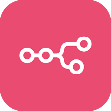

<h1 align="center">Hi 👋, I'm Sudharshan</h1>
<h3 align="center">Computer Science Engineering Student | Developer | Tech Explorer</h3>

  

---

## 🚀 About Me

- 🎓 Computer Science Engineering Student  
- 📚 Currently learning **DSA & Problem Solving**  
- 💡 Passionate about **Code, Innovation & Different Thinking**  
- 🔍 I enjoy building meaningful digital experiences

> *“Different thinking leads to different results — and that mindset shapes everything I build.”*

---

## 🛠️ Skills

<table align="center">
<tr>
  <td align="center" width="25%">
    <b>Frontend</b>  
    
  </td>
  <td align="center" width="25%">
    <b>Backend</b>  
    
  </td>
  <td align="center" width="25%">
    <b>Languages</b>  
    
  </td>
  <td align="center" width="25%">
  <b>Tools / Design</b>  
  
      &nbsp;
    
    

  
</td>
</tr>
</table>

---

## 📫 Connect With Me

  
  

---

